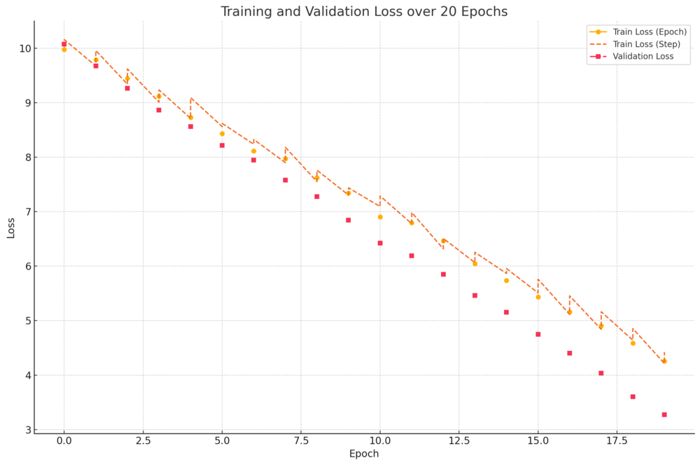
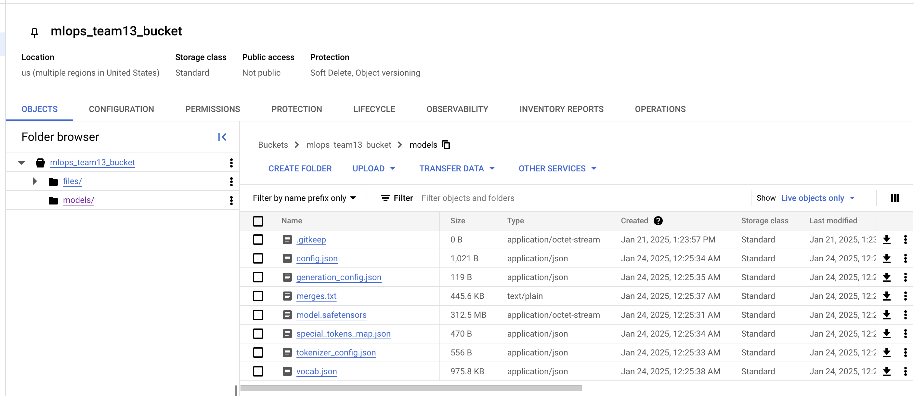
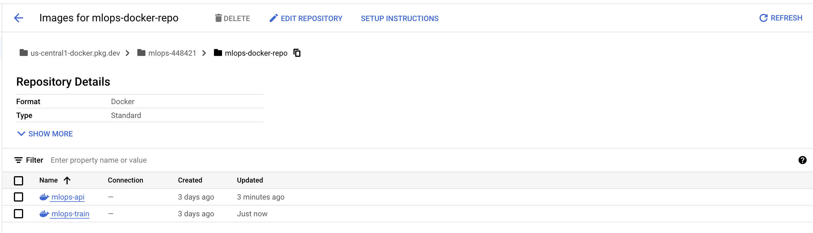
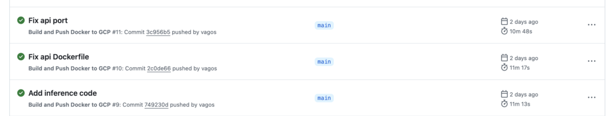
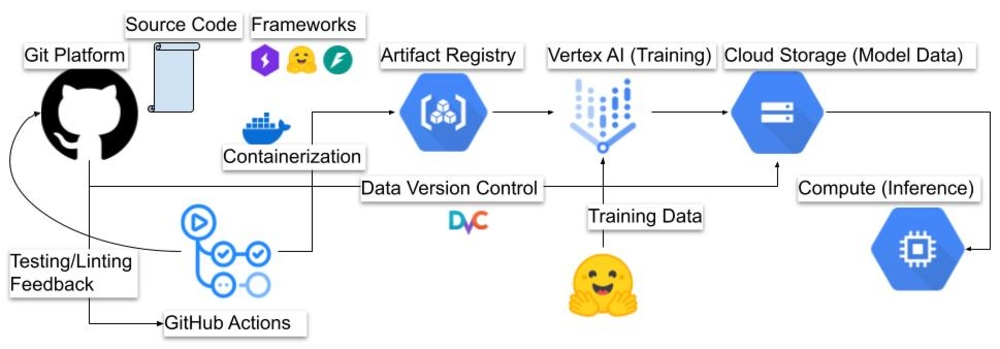

# Exam template for 02476 Machine Learning Operations

This is the report template for the exam. Please only remove the text formatted as with three dashes in front and behind
like:

```--- question 1 fill here ---```

Where you instead should add your answers. Any other changes may have unwanted consequences when your report is
auto-generated at the end of the course. For questions where you are asked to include images, start by adding the image
to the `figures` subfolder (please only use `.png`, `.jpg` or `.jpeg`) and then add the following code in your answer:

```markdown

```

In addition to this markdown file, we also provide the `report.py` script that provides two utility functions:

Running:

```bash
python report.py html
```

Will generate a `.html` page of your report. After the deadline for answering this template, we will auto-scrape
everything in this `reports` folder and then use this utility to generate a `.html` page that will be your serve
as your final hand-in.

Running

```bash
python report.py check
```

Will check your answers in this template against the constraints listed for each question e.g. is your answer too
short, too long, or have you included an image when asked. For both functions to work you mustn't rename anything.
The script has two dependencies that can be installed with

```bash
pip install typer markdown
```

## Overall project checklist

The checklist is *exhaustive* which means that it includes everything that you could do on the project included in the
curriculum in this course. Therefore, we do not expect at all that you have checked all boxes at the end of the project.
The parenthesis at the end indicates what module the bullet point is related to. Please be honest in your answers, we
will check the repositories and the code to verify your answers.

## Week 1

- [x] Create a git repository (M5)
- [x] Make sure that all team members have write access to the GitHub repository (M5)
- [x] Create a dedicated environment for you project to keep track of your packages (M2)
- [x] Create the initial file structure using cookiecutter with an appropriate template (M6)
- [x] Fill out the data.py file such that it downloads whatever data you need and preprocesses it (if necessary) (M6)
- [x] Add a model to model.py and a training procedure to train.py and get that running (M6)
- [x] Remember to fill out the requirements.txt and requirements_dev.txt file with whatever dependencies that you are using (M2+M6)
- [x] Remember to comply with good coding practices (pep8) while doing the project (M7)
- [x] Do a bit of code typing and remember to document essential parts of your code (M7)
- [x] Setup version control for your data or part of your data (M8)
- [x] Add command line interfaces and project commands to your code where it makes sense (M9)
- [x] Construct one or multiple docker files for your code (M10)
- [x] Build the docker files locally and make sure they work as intended (M10)
- [x] Write one or multiple configurations files for your experiments (M11)
- [x] Used Hydra to load the configurations and manage your hyperparameters (M11)
- [x] Use profiling to optimize your code (M12)
- [x] Use logging to log important events in your code (M14)
- [ ] Use Weights & Biases to log training progress and other important metrics/artifacts in your code (M14)
- [ ] Consider running a hyperparameter optimization sweep (M14)
- [x] Use PyTorch-lightning (if applicable) to reduce the amount of boilerplate in your code (M15)

## Week 2

- [x] Write unit tests related to the data part of your code (M16)
- [x] Write unit tests related to model construction and or model training (M16)
- [x] Calculate the code coverage (M16)
- [x] Get some continuous integration running on the GitHub repository (M17)
- [ ] Add caching and multi-os/python/pytorch testing to your continuous integration (M17)
- [x] Add a linting step to your continuous integration (M17)
- [x] Add pre-commit hooks to your version control setup (M18)
- [ ] Add a continues workflow that triggers when data changes (M19)
- [x] Add a continues workflow that triggers when changes to the model registry is made (M19)
- [x] Create a data storage in GCP Bucket for your data and link this with your data version control setup (M21)
- [x] Create a trigger workflow for automatically building your docker images (M21)
- [x] Get your model training in GCP using either the Engine or Vertex AI (M21)
- [x] Create a FastAPI application that can do inference using your model (M22)
- [x] Deploy your model in GCP using either Functions or Run as the backend (M23)
- [ ] Write API tests for your application and setup continues integration for these (M24)
- [ ] Load test your application (M24)
- [ ] Create a more specialized ML-deployment API using either ONNX or BentoML, or both (M25)
- [ ] Create a frontend for your API (M26)

## Week 3

- [ ] Check how robust your model is towards data drifting (M27)
- [ ] Deploy to the cloud a drift detection API (M27)
- [ ] Instrument your API with a couple of system metrics (M28)
- [x] Setup cloud monitoring of your instrumented application (M28)
- [x] Create one or more alert systems in GCP to alert you if your app is not behaving correctly (M28)
- [ ] If applicable, optimize the performance of your data loading using distributed data loading (M29)
- [ ] If applicable, optimize the performance of your training pipeline by using distributed training (M30)
- [x] Play around with quantization, compilation and pruning for you trained models to increase inference speed (M31)

## Extra
- [ ] Write some documentation for your application (M32)
- [ ] Publish the documentation to GitHub Pages (M32)
- [x] Revisit your initial project description. Did the project turn out as you wanted?
- [x] Create an architectural diagram over your MLOps pipeline
- [x] Make sure all group members have an understanding about all parts of the project
- [x] Uploaded all your code to GitHub

## Group information

### Question 1
> **Enter the group number you signed up on <learn.inside.dtu.dk>**
>
> Answer:

13

### Question 2
> **Enter the study number for each member in the group**
>
> Example:
>
> *sXXXXXX, sXXXXXX, sXXXXXX*
>
> Answer:

s232462, s233095

### Question 3
> **A requirement to the project is that you include a third-party package not covered in the course. What framework**
> **did you choose to work with and did it help you complete the project?**
>
> Recommended answer length: 100-200 words.
>
> Example:
> *We used the third-party framework ... in our project. We used functionality ... and functionality ... from the*
> *package to do ... and ... in our project*.
>
> Answer:

We used the third-party framework `Transformers` by Hugging Face in our project.
This library provides state-of-the-art
pre-trained models and tools for natural language processing tasks, such as
tokenization and text generation.

Specifically, we used the `GPT2LMHeadModel` and `GPT2Tokenizer` modules to
fine-tune a pre-trained GPT-2 model for our text generation task. The
library enabled us to quickly load pre-trained weights, fine-tune
the model with minimal effort.

Since this library provides yet another abstraction over common building blocks
of modern NLP models, it significantly reduced the complexity of the model
architecture and the tokenization processe, allowing us to focus on building and
evaluating our pipeline. Its versatility and extensive documentation
made it an excellent choice for enhancing the project while adhering to modern
NLP best practices. This framework played a key role in the successful
completion of the project.

## Coding environment

> In the following section we are interested in learning more about you local development environment. This includes
> how you managed dependencies, the structure of your code and how you managed code quality.

### Question 4

> **Explain how you managed dependencies in your project? Explain the process a new team member would have to go**
> **through to get an exact copy of your environment.**
>
> Recommended answer length: 100-200 words
>
> Example:
> *We used ... for managing our dependencies. The list of dependencies was auto-generated using ... . To get a*
> *complete copy of our development environment, one would have to run the following commands*
>
> Answer:

We used Conda for managing our dependencies in the project.
Dependencies are explicitly listed in a `requirements.txt` file for runtime
dependencies and in a `requirements-dev.txt` file for development
dependencies.
We also leveraged the `invoke` library to streamline the setup process by
defining tasks for creating the environment, installing dependencies, and
setting up development tools.

To set up an exact copy of our environment, a new team member would need to follow these steps:
	1.	Create a virtual environment using Conda:
Run the command `invoke create-environment` to create a new environment with the correct Python version and necessary tools.
	2.	Install runtime dependencies:
Run `invoke requirements` to install all required libraries from the `requirements.txt file`.
	3.	Install development dependencies:
Finally, run `invoke dev-requirements` to install development tools like linters, formatters, test runners, and version control tools (e.g., `dvc`).

### Question 5

> **We expect that you initialized your project using the cookiecutter template. Explain the overall structure of your**
> **code. What did you fill out? Did you deviate from the template in some way?**
>
> Recommended answer length: 100-200 words
>
> Example:
> *From the cookiecutter template we have filled out the ... , ... and ... folder. We have removed the ... folder*
> *because we did not use any ... in our project. We have added an ... folder that contains ... for running our*
> *experiments.*
>
> Answer:

From the cookiecutter template, we filled out the `configs`, `dockerfiles`, and `src` folders. 
The configs folder contains the Hydra configuration files, and we added `config.yaml` for the default project settings. 
The dockerfiles folder now includes specific files for api and train, 
and we removed `dependabot.yaml` since we aren't using dependabot for dependency updates.

We added `quantize.py` and `util.py` under `src/mlops` for quantization, pruning, and utility functions,
which were not part of the original template. 
We also introduced an outputs folder under the root directory for storing generated results, 
such as models or intermediate outputs, and a `.dvc/` folder to integrate DVC for versioning data and models.

Lastly, we updated `.github/workflows` to include `ci.yaml`, `container.yml`, and `gac.yml` for CI/CD and cloud integration.
This adaptation allowed us to support additional pipelines and tools specific to our project needs.

### Question 6

> **Did you implement any rules for code quality and format? What about typing and documentation? Additionally,**
> **explain with your own words why these concepts matters in larger projects.**
>
> Recommended answer length: 100-200 words.
>
> Example:
> *We used ... for linting and ... for formatting. We also used ... for typing and ... for documentation. These*
> *concepts are important in larger projects because ... . For example, typing ...*
>
> Answer:

We implemented rules for code quality and format by using `Ruff` for linting and 
type checking to ensure consistency and correctness in the codebase. 
Ruff helps us automatically detect and fix issues like unused imports,
missing or unnecessary f-strings, and improper exception handling. 
Additionally, we incorporated type hints throughout the project 
to enforce type safety and make the code easier to understand and maintain.

Documentation was written for all major functions and modules 
to provide clarity on their purpose, inputs, and outputs. 

These concepts are important in larger projects because 
they improve code readability, reduce errors, and make debugging easier.
For example, type checking prevents mismatched data usage, which could otherwise lead to runtime errors. 
Linting enforces coding standards, ensuring that code written by different contributors follows a consistent style. 

## Version control

> In the following section we are interested in how version control was used in your project during development to
> corporate and increase the quality of your code.

### Question 7

> **How many tests did you implement and what are they testing in your code?**
>
> Recommended answer length: 50-100 words.
>
> Example:
> *In total we have implemented X tests. Primarily we are testing ... and ... as these the most critical parts of our*
> *application but also ... .*
>
> Answer:

In total, we have implemented 16 tests. 
These tests cover data loading, preprocessing, and dataloader consistency, 
which ensure the pipeline can handle various dataset configurations. 
We also test model construction, initialization, and forward passes 
to verify that the core functionalities of the model are working as expected. 
Additionally, training steps, validation steps, and optimizer configuration 
are tested to ensure the model training loop behaves correctly.

### Question 8

> **What is the total code coverage (in percentage) of your code? If your code had a code coverage of 100% (or close**
> **to), would you still trust it to be error free? Explain you reasoning.**
>
> Recommended answer length: 100-200 words.
>
> Example:
> *The total code coverage of code is X%, which includes all our source code. We are far from 100% coverage of our **
> *code and even if we were then...*
>
> Answer:

The total code coverage of our code is 79%, which includes core components 
like data loading (93%), evaluation (44%), and model-related code (100%).
While this is a good starting point, there is room for improvement, 
especially in the evaluation module, which has significant untested code.

Even with 100% code coverage, the quality of the tests is more important than the quantity.
High coverage might only indicate that the code was executed, 
but it doesn't ensure that all edge cases and logic branches were tested rigorously. 
Achieving high-quality code requires not only high coverage but also well-designed 
tests that validate functionality under diverse scenarios, including edge cases and failure paths.

### Question 9

> **Did you workflow include using branches and pull requests? If yes, explain how. If not, explain how branches and**
> **pull request can help improve version control.**
>
> Recommended answer length: 100-200 words.
>
> Example:
> *We made use of both branches and PRs in our project. In our group, each member had an branch that they worked on in*
> *addition to the main branch. To merge code we ...*
>
> Answer:

We didn’t use branches or pull requests in our project. Instead, we adopted a
rebase-based workflow where team members externally coordinated tasks and held
'locks" on specific parts of the codebase to avoid conflicts. Each contributor
made sure their work aligned with the latest version of the main branch by
frequently rebasing their changes. This allowed for fast iteration, which was
well-suited for our three-week project
timeline.

While branches and pull requests are beneficial for managing long-running or
complex projects, we felt they might slow down agile development in a
short-term project like ours, where quick feedback and collaboration were
prioritized. Branches could introduce unnecessary overhead for small, rapidly
evolving tasks. Version drift is a common failure mode is such cases.
However, for larger projects, branches and pull requests would enhance version
control by providing better isolation of features, thorough review processes,
and an audit trail of changes

### Question 10

> **Did you use DVC for managing data in your project? If yes, then how did it improve your project to have version**
> **control of your data. If no, explain a case where it would be beneficial to have version control of your data.**
>
> Recommended answer length: 100-200 words.
>
> Example:
> *We did make use of DVC in the following way: ... . In the end it helped us in ... for controlling ... part of our*
> *pipeline*
>
> Answer:

We used DVC (Data Version Control) in our project to manage and version control
the model weights after training. With DVC, we were able to
track changes to our model weights and ensure reproducibility
across different stages of development. We configured Google Cloud Storage as
the DVC backend, which allows us to store and retrieve large files like model
weights without overloading our Git repository.

DVC helped by providing a structured way to manage
binary artifacts, making it easy to switch between different versions of the
trained model. It also ensured team members could access
the correct version of the model without confusion, improving collaboration.


### Question 11

> **Discuss you continuous integration setup. What kind of continuous integration are you running (unittesting,**
> **linting, etc.)? Do you test multiple operating systems, Python  version etc. Do you make use of caching? Feel free**
> **to insert a link to one of your GitHub actions workflow.**
>
> Recommended answer length: 200-300 words.
>
> Example:
> *We have organized our continuous integration into 3 separate files: one for doing ..., one for running ... testing*
> *and one for running ... . In particular for our ..., we used ... .An example of a triggered workflow can be seen*
> *here: <weblink>*
>
> Answer:

We have set up continuous integration (CI) with GitHub Actions to ensure the quality and stability of our codebase. 
Our CI pipeline is organized into two separate workflows: 
one for running tests and linting (CI Pipeline) and another for linting only (Lint-Only Pipeline).

The CI Pipeline is triggered on pushes or pull requests to the main branch.
It performs the following tasks: code checkout using `actions/checkout@v3`, Python setup with version 3.11 using `actions/setup-python@v4`, installation of dependencies and tools, linting with Ruff using invoke lint, and running all unit tests with invoke test.

The Lint-Only Pipeline is a lightweight workflow that focuses solely on linting the codebase using Ruff.
It runs on the main branch to quickly catch formatting or code quality issues and ensures compliance with coding standards.

Key features of our CI setup include using Python 3.11 for compatibility with the latest version, 
running on ubuntu-latest for a consistent runtime environment, caching Python dependencies with pip to speed up subsequent runs, 
and using invoke tasks to simplify and modularize workflows. 
These workflows ensure code reliability by automating repetitive tasks and allowing developers to focus on writing quality code.

An example of our GitHub Actions workflow can be found [here](https://github.com/yoghurtina/mlops/actions/runs/12943237359).

## Running code and tracking experiments

> In the following section we are interested in learning more about the experimental setup for running your code and
> especially the reproducibility of your experiments.

### Question 12

> **How did you configure experiments? Did you make use of config files? Explain with coding examples of how you would**
> **run a experiment.**
>
> Recommended answer length: 50-100 words.
>
> Example:
> *We used a simple argparser, that worked in the following way: Python  my_script.py --lr 1e-3 --batch_size 25*
>
> Answer:

We configured our experiments using `yaml` config files for structured and
reusable parameter management. This allowed us to define model, data, training,
and other pipeline-specific configurations in a single place. For example, our
`config.yaml` included parameters such as:

```yaml
model:
  name: "distilbert/distilgpt2"
  learning_rate: 5e-5
  warmup_steps: 500
  path: "gs://mlops_team13_bucket/models"

data:
  dataset_name: "wikitext"
  config_name: "wikitext-2-raw-v1"
  batch_size: 4
  max_length: 512
  subset_size: 100

training:
  max_epochs: 3
  devices: 1
  precision: 16
  output_path: "outputs/"
```

We used Hydra to load and override configuration values
dynamically. For instance, the command:
```bash
python train.py training.max_epochs=5 model.learning_rate=1e-4
```
overrides the default max_epochs and learning_rate while executing the training
script.

### Question 13

> **Reproducibility of experiments are important. Related to the last question, how did you secure that no information**
> **is lost when running experiments and that your experiments are reproducible?**
>
> Recommended answer length: 100-200 words.
>
> Example:
> *We made use of config files. Whenever an experiment is run the following happens: ... . To reproduce an experiment*
> *one would have to do ...*
>
> Answer:

We ensured the reproducibility of our experiments by leveraging **config
files** and systematic logging. Each experiment was defined using a structured
`config.yaml` file, which included all parameters such as model name, learning
rate, dataset paths, and training settings. These configurations were
version-controlled, and any changes made during experiments were tracked to
prevent loss of information.

Whenever an experiment was run, we logged the complete configuration alongside
the experiment results, such as metrics, checkpoints, and outputs, using both
logging and additional tools like DVC for versioning model
weights. We also stored experiment artifacts, including models and logs, in
Google Cloud Storage for centralized access.

To reproduce an experiment, a team member only needed to retrieve the logged
configuration and run the same script with the specified parameters. For
example:

```bash
python train.py hydra.run.dir=/path/to/logs/exp1
```

### Question 14

> **Upload 1 to 3 screenshots that show the experiments that you have done in W&B (or another experiment tracking**
> **service of your choice). This may include loss graphs, logged images, hyperparameter sweeps etc. You can take**
> **inspiration from [this figure](figures/wandb.png). Explain what metrics you are tracking and why they are**
> **important.**
>
> Recommended answer length: 200-300 words + 1 to 3 screenshots.
>
> Example:
> *As seen in the first image when have tracked ... and ... which both inform us about ... in our experiments.*
> *As seen in the second image we are also tracking ... and ...*
>
> Answer:




In this project, we focused on tracking key metrics during the fine-tuning
of the GPT-2 model using PyTorch Lightning. While we did not use Weights &
Biases (W&B), we leveraged PyTorch Lightning’s in-built logging capabilities
and CSVLogger to record and visualize training progress.

Metrics Tracked
1.	Training Loss (per epoch and step):
    Importance: Training loss indicates how well the model is learning from the
training data. Monitoring this metric helps assess if the model is effectively
minimizing the loss and identifies potential overfitting or underfitting
trends.
2.	Validation Loss (per epoch):
    Importance: Validation loss reflects the model’s performance on unseen
validation data. The evaluation includes a measure of perplexity, which
indicates how well the model predicts the next token in the sequence.

Observations:
As shown in the provided plot, training and validation losses consistently
decrease over the 20 epochs, reflecting improved performance.
Validation loss remains close to training loss throughout,
indicating that the model is not overfitting significantly.
The slight
variations between epoch-based and step-based training loss demonstrate
fine-grained loss fluctuations during the training process.

Tools and Techniques:
* CSVLogger: Captured all training and validation metrics for easy plotting and analysis.
* Matplotlib: Used to visualize the loss trends over epochs for better interpretability.
* ModelCheckpoint Callback: Saves the best model based on validation loss, enabling reproducibility and further evaluation.

### Question 15

> **Docker is an important tool for creating containerized applications. Explain how you used docker in your**
> **experiments/project? Include how you would run your docker images and include a link to one of your docker files.**
>
> Recommended answer length: 100-200 words.
>
> Example:
> *For our project we developed several images: one for training, inference and deployment. For example to run the*
> *training docker image: `docker run trainer:latest lr=1e-3 batch_size=64`. Link to docker file: <weblink>*
>
> Answer:

For our project, we used Docker to containerize the training and evaluation workflows for the GPT-2 model, 
ensuring consistency and reproducibility across different environments. 
The Docker setup allows running experiments seamlessly, 
either through the CLI or within Docker containers, making it simple to deploy and scale.

- To build a docker image run:
```bash
docker build -f dockerfiles/train.dockerfile -t mlops-train .
```
- To build the evaluation image run:
```bash
docker build -f dockerfiles/evaluate.dockerfile -t mlops-evaluate .
```

To fine-tune and evaluate the model:
```bash
   docker run --rm mlops-train
   docker run --rm mlops-evaluate
```
This approach eliminates environment inconsistencies 
and simplifies collaboration by ensuring everyone works with identical setups.

### Question 16

> **When running into bugs while trying to run your experiments, how did you perform debugging? Additionally, did you**
> **try to profile your code or do you think it is already perfect?**
>
> Recommended answer length: 100-200 words.
>
> Example:
> *Debugging method was dependent on group member. Some just used ... and others used ... . We did a single profiling*
> *run of our main code at some point that showed ...*
>
> Answer:

For debugging, we employed a combination of techniques to ensure efficient
resolution of issues. First, we relied on extensive logging throughout the
codebase to track key operations, parameter values, and error messages. This
helped us pinpoint the exact stages where issues occurred, particularly during
data loading, training, and validation steps.

We also utilized `git blame` to trace changes in the codebase when encountering
unexpected behavior. This allowed us to identify and investigate recent
modifications that might have introduced bugs, making the debugging process
more targeted and efficient. This was useful in two cases where we wanted to make
major modifications to the training pipeline, in order to add plotting of the training metrics.

Additionally, we leveraged [mprofile](https://github.com/timpalpant/mprofile) to profile memory usage. This was
particularly important because the model was being deployed on a low-memory
machine, and we needed to ensure that the memory footprint remained manageable.
The profiling allowed us to identify the minimum memory requirements for the
model and optimize the code accordingly. The deployed code runs on 700MB of RAM.

While our profiling focused primarily on memory usage, these combined debugging
strategies resulted in code that ran smoothly and was well-suited for
deployment in resource-constrained environments.

## Working in the cloud

> In the following section we would like to know more about your experience when developing in the cloud.

### Question 17

> **List all the GCP services that you made use of in your project and shortly explain what each service does?**
>
> Recommended answer length: 50-200 words.
>
> Example:
> *We used the following two services: Engine and Bucket. Engine is used for... and Bucket is used for...*
>
> Answer:

We used the following GCP services in our project:
1. Cloud Storage (Buckets): Used for saving and retrieving model weights and datasets. It provides scalable and durable storage solutions.
2. Compute Engine: Utilized for deploying our application, offering virtual machines to run workloads with customizable configurations.
3. Vertex AI: Used for launching and managing training jobs, providing a unified interface for ML workflows, including hyperparameter tuning and training.
4. Artifact Registry: Used for storing and managing container images.


### Question 18

> **The backbone of GCP is the Compute engine. Explained how you made use of this service and what type of VMs**
> **you used?**
>
> Recommended answer length: 100-200 words.
>
> Example:
> *We used the compute engine to run our ... . We used instances with the following hardware: ... and we started the*
> *using a custom container: ...*
>
> Answer:

We used the Compute Engine to run our training and API deployment tasks. For
training, we utilized a VM instance with the e2-standard-4 machine type, which
includes 1 vCPU and 1 GB of memory. This configuration was chosen as it
provided a cost-effective balance of performance and speed for our
workload.

To start the instance, we specified a custom container image that contained our
inference code and dependencies. The container image was built using a
Dockerfile and stored in the Google Container Registry. 
The API container image was pulled from the registry and run on
the VM, resulting in consistent behavior across local and cloud environments.

The Compute Engine was instrumental in providing scalable and reliable
infrastructure for our deployment tasks.

### Question 19

> **Insert 1-2 images of your GCP bucket, such that we can see what data you have stored in it.**
> **You can take inspiration from [this figure](figures/bucket.png).**
>
> Answer:

In our GCP bucket, we stored the model weights and vocabulary files.



### Question 20

> **Upload 1-2 images of your GCP artifact registry, such that we can see the different docker images that you have**
> **stored. You can take inspiration from [this figure](figures/registry.png).**
>
> Answer:

In our artifact registry, we stored containers for our training and serving code.



### Question 21

> **Upload 1-2 images of your GCP cloud build history, so we can see the history of the images that have been build in**
> **your project. You can take inspiration from [this figure](figures/build.png).**
>
> Answer:


For building our containers, we used GitHub Actions, which built the images and pushed them to the Artifact Registry.



### Question 22

> **Did you manage to train your model in the cloud using either the Engine or Vertex AI? If yes, explain how you did**
> **it. If not, describe why.**
>
> Recommended answer length: 100-200 words.
>
> Example:
> *We managed to train our model in the cloud using the Engine. We did this by ... . The reason we choose the Engine*
> *was because ...*
>
> Answer:

We managed to train our model in the cloud using Vertex AI. 
To achieve this, we defined a custom training job configuration in a `train.yml` file. 
The job specified the use of a e2-standard-4 machine type with one replica, 
and the training container was built and hosted at:
`us-central1-docker.pkg.dev/mlops-448421/mlops-docker-repo/mlops-train:latest`.

The job was executed by running the following command:
```bash
gcloud ai custom-jobs create --region=us-central1 --config=jobs/train.yml.
```
We chose Vertex AI for its seamless integration with GCP services, 
support for custom Docker images, and scalable infrastructure, 
which allowed us to focus on efficient model development 
rather than dealing with infrastructure management complexities.

## Deployment

### Question 23

> **Did you manage to write an API for your model? If yes, explain how you did it and if you did anything special. If**
> **not, explain how you would do it.**
>
> Recommended answer length: 100-200 words.
>
> Example:
> *We did manage to write an API for our model. We used FastAPI to do this. We did this by ... . We also added ...*
> *to the API to make it more ...*
>
> Answer:

We successfully wrote an API for our model using FastAPI. 
This API provides a simple interface for generating text based on a user-provided prompt.

The API loads a pre-trained GPT-2 model and its tokenizer at startup, 
either from a local directory or a GCS bucket, ensuring flexibility in deployment.
It exposes a `/generate` endpoint where users can send a POST request with a 
JSON payload containing a `prompt` and an optional `max_length` parameter for text generation. 
The `/generate` endpoint validates inputs and uses the model to generate text based on the given prompt, 
returning the generated text in the response.

To generate text, a client can send the following request:
```bash
curl -X POST http://<host>:<port>/generate \
-H "Content-Type: application/json" \
-d '{"prompt": "Once upon a time", "max_length": 100}'
```
The API ensures that inputs are validated, such as checking for a non-empty prompt and a valid max_length. 
It logs important events, such as input prompts and generated text, for debugging and monitoring. 
The design makes it easy to deploy in the cloud. 

### Question 24

> **Did you manage to deploy your API, either in locally or cloud? If not, describe why. If yes, describe how and**
> **preferably how you invoke your deployed service?**
>
> Recommended answer length: 100-200 words.
>
> Example:
> *For deployment we wrapped our model into application using ... . We first tried locally serving the model, which*
> *worked. Afterwards we deployed it in the cloud, using ... . To invoke the service an user would call*
> *`curl -X POST -F "file=@file.json"<weburl>`*
>
> Answer:

We successfully deployed our API both locally and in the cloud using FastAPI.
To wrap our model, we created an application that loads the pre-trained GPT-2
model from a path specified from our config file (either local or Google Cloud Storage).
The API
exposes an endpoint `/generate` to generate text based on a prompt provided by
the user.

Deployment Details:
1.	Local Deployment:
    * We started the service locally by running `invoke serve`,
    which served the application on http://127.0.0.1:8080.
2.	Cloud Deployment:
    * The API was containerized using Docker and deployed to a cloud platform
    (e.g., Google Cloud Run). The Docker image was built and pushed to a
    container registry, and the service was exposed via an HTTP endpoint.

To invoke the deployed service, a user can send a POST request with a JSON
payload containing the prompt to the API endpoint. For example:

```bash
curl -X POST \
     -H "Content-Type: application/json" \
     -d '{"prompt": "Once upon a time", "max_length": 50}' \
     $URL/generate
```

An example of the deployed API URL (currently inactive) is `https://mlops-api-752599873459.us-central1.run.app`.

### Question 25

> **Did you perform any unit testing and load testing of your API? If yes, explain how you did it and what results for**
> **the load testing did you get. If not, explain how you would do it.**
>
> Recommended answer length: 100-200 words.
>
> Example:
> *For unit testing we used ... and for load testing we used ... . The results of the load testing showed that ...*
> *before the service crashed.*
>
> Answer:

We performed manual load testing on our API by simulating a high number of
concurrent requests from multiple devices, including our laptops. To do this,
we created a simple script to spam the API with frequent requests in a short
time frame, monitoring how the system handled the increased load. During this
testing, we recorded any errors or crashes
encountered. No crashes were observed, and the API responded to all requests.

To conduct more formal load testing in the future, we would use tools like
Locust to simulate thousands of concurrent users, measure the system's
performance under various conditions, and identify the maximum load the API can
handle before crashing. This would provide more precise insights into scaling
and optimization requirements for deployment in production environments.    
 
### Question 26

> **Did you manage to implement monitoring of your deployed model? If yes, explain how it works. If not, explain how**
> **monitoring would help the longevity of your application.**
>
> Recommended answer length: 100-200 words.
>
> Example:
> *We did not manage to implement monitoring. We would like to have monitoring implemented such that over time we could*
> *measure ... and ... that would inform us about this ... behaviour of our application.*
>
> Answer:

Yes, we managed to implement monitoring for our deployed model. The monitoring
system tracks the data plane API request count per project and sets up alerting
mechanisms for anomalies or threshold breaches. For example, we track API
requests and use a predefined threshold to trigger
alerts when the requests exceed set limits (for our testing more than 1 request per second).

Additionally, alerts are sent when Service Level Objective (SLO) burn rates
exceed thresholds.
For instance, a burn rate
exceeding a threshold of 10 triggered an alert, notifying us of potential
latency issues in real-time.

All alerts are sent to a common e-mail address.

## Overall discussion of project

> In the following section we would like you to think about the general structure of your project.

### Question 27

> **How many credits did you end up using during the project and what service was most expensive? In general what do**
> **you think about working in the cloud?**
>
> Recommended answer length: 100-200 words.
>
> Example:
> *Group member 1 used ..., Group member 2 used ..., in total ... credits was spend during development. The service*
> *costing the most was ... due to ... . Working in the cloud was ...*
>
> Answer:

Ioanna (s233095) used 5.53 credits, and group member Evangelos (s232462) used 5.01 credits, 
for a total of 10.54 credits spent during the project. 
The most expensive service was fine-tuning the GPT-2 model on GCP, 
as it required high-performance GPUs to process our dataset effectively. 
To minimize unnecessary costs, we made sure to turn off instances and services when not in use, 
ensuring that we only paid for the resources we actively needed.

Working in the cloud was a great experience overall. 
It allowed us to access powerful resources on demand, making tasks like model training, deployment, and monitoring much easier. 
The scalability and flexibility of the cloud enabled us to experiment with various configurations and ensure reproducibility. 
However, it also required careful monitoring.
Overall, the benefits of cloud computing in terms of speed and scalability far outweighed the challenges.

### Question 28

> **Did you implement anything extra in your project that is not covered by other questions? Maybe you implemented**
> **a frontend for your API, use extra version control features, a drift detection service, a kubernetes cluster etc.**
> **If yes, explain what you did and why.**
>
> Recommended answer length: 0-200 words.
>
> Example:
> *We implemented a frontend for our API. We did this because we wanted to show the user ... . The frontend was*
> *implemented using ...*
>
> Answer:

We did not implement anything extra in our project that is not covered by the other questions. 
However, we would like to set up a Kubernetes cluster in the future. 
Kubernetes would provide automated deployment and management of containerized applications. 
This would allow us to handle high traffic efficiently by scaling our API dynamically based on demand. 
It also ensures high availability and fault tolerance, as Kubernetes can redistribute workloads if any pods fail. 
Additionally, it simplifies the process of deploying updates and managing multiple environments, 
which is useful for maintaining a robust pipeline. 
This would make our project more scalable and resilient for real-world use cases.

### Question 29

> **Include a figure that describes the overall architecture of your system and what services that you make use of.**
> **You can take inspiration from [this figure](figures/overview.png). Additionally, in your own words, explain the**
> **overall steps in figure.**
>
> Recommended answer length: 200-400 words
>
> Example:
>
> *The starting point of the diagram is our local setup, where we integrated ... and ... and ... into our code.*
> *Whenever we commit code and push to GitHub, it auto triggers ... and ... . From there the diagram shows ...*
>
> Answer:



The starting point of the architecture is the Git Platform, where our source
code resides. We use version control to manage and track changes to the
codebase. 
To build our end to end system, our core frameworks are PyTorch-lightning, Hugging Face Transformers, and FastAPI.

On every code commit and push to the Git repository, GitHub Actions are
triggered. These actions run automated workflows to provide testing and linting
feedback. This makes sure code quality in retained and errors are detected early in the
development cycle.

In Github actions, containerization (using Docker) is initiated.
This step creates portable and consistent environments for the model and its
dependencies. The containerized artifacts are stored in a secure Artifact
Registry for further use.

We version-control the model weights
managed by Data Version Control (DVC), ensuring reproducibility and enabling
tracking changes. Training data comes from the Hugging Face datasets library.

Model training is performed in the cloud using Vertex AI, which provides
scalable infrastructure for training and easy deployment using the `gcloud` CLI.

The trained model, along with its associated metadata, is stored in Cloud
Storage for ease of access. 

Finally, Google Cloud Compute Engine is used to deploy the FastAPI application
for inference. The API endpoint is exposed to the internet, allowing users to
interact with the model for text generation.

### Question 30

> **Discuss the overall struggles of the project. Where did you spend most time and what did you do to overcome these**
> **challenges?**
>
> Recommended answer length: 200-400 words.
>
> Example:
> *The biggest challenges in the project was using ... tool to do ... . The reason for this was ...*
>
> Answer:
The biggest challenge in our project was training the GPT-2 model 
due to its size and computational requirements, 
which made local training infeasible because of hardware limitations.
We overcame this by using cloud-based GPU resources on Google Cloud Platform, 
which provided the necessary computational power but 
required careful cost management to avoid exceeding our budget.

Another significant challenge was deployment. 
Many seemingly small issues, such as environment differences between local and remote setups, 
caused unexpected bugs and delays. For example, dependencies that worked locally 
would occasionally fail in the cloud due to version mismatches or missing configurations. 
Debugging these problems was time-consuming and required analyzing logs and 
making incremental fixes to ensure smooth operation and robust performance.

To address these challenges, we focused on creating consistent 
and reliable Docker images to package our application and its dependencies. 
This approach ensured that the environments were reproducible across local and remote setups, 
reducing errors caused by mismatched configurations. Additionally, we used structured logging, 
monitoring tools, and automated workflows to identify and resolve deployment issues faster. 
These solutions not only streamlined the project but also provided valuable lessons 
in managing complex machine learning workflows, deployments, 
and infrastructure effectively at scale with minimal downtime.

### Question 31

> **State the individual contributions of each team member. This is required information from DTU, because we need to**
> **make sure all members contributed actively to the project. Additionally, state if/how you have used generative AI**
> **tools in your project.**
>
> Recommended answer length: 50-300 words.
>
> Example:
> *Student sXXXXXX was in charge of developing of setting up the initial cookie cutter project and developing of the*
> *docker containers for training our applications.*
> *Student sXXXXXX was in charge of training our models in the cloud and deploying them afterwards.*
> *All members contributed to code by...*
> *We have used ChatGPT to help debug our code. Additionally, we used GitHub Copilot to help write some of our code.*
> Answer:

Student s233095 (Ioanna) was primarily responsible 
for setting up the foundational aspects of the project during Week 1.
This included creating the initial file structure using cookiecutter, 
setting up the Git repository, implementing data loading and preprocessing, 
creating the model, and integrating training and evaluation logic. 
Ioanna also wrote unit tests related to data loading, model construction, and training, 
calculated code coverage, set up continuous integration workflows, added pre-commit hooks, 
and ensured the code followed good practices like linting and typing.

Student s232462 (Evangelos) focused on deployment tasks of the project in Weeks 2 and 3. 
He handled the creation and deployment of the FastAPI application for inference, 
deployed the model in GCP using Cloud Run, set up cloud monitoring and alert systems, 
and worked on optimizing the trained models with techniques like quantization and pruning. 
Evangelos also completed tasks such creating workflows triggered by model registry updates, 
and conducting cloud-based training using GCP. 

During Week 3, the team handled tasks like setting up cloud-based drift detection, 
instrumenting the API with system metrics, and creating alert systems for monitoring.

Both team members ensured full understanding of all aspects of the project 
and collaborated on debugging and improving the pipeline. 

Generative AI tools like ChatGPT were used to debug errors and optimize specific code sections, 
and GitHub Copilot was occasionally used for auto-completing boilerplate code. 
